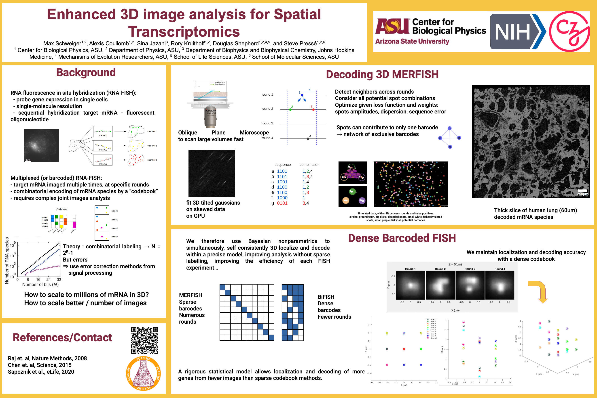
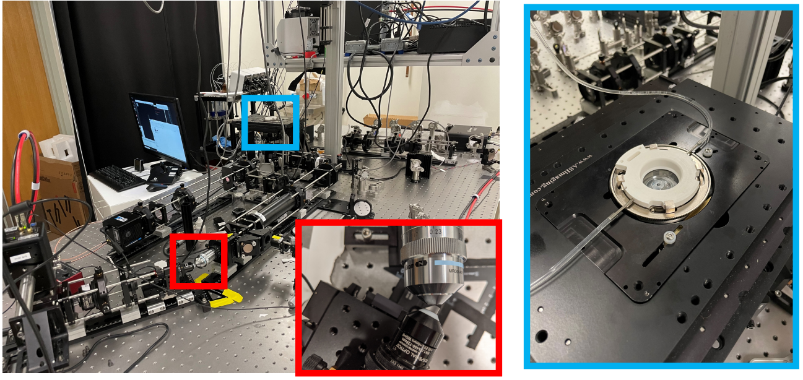
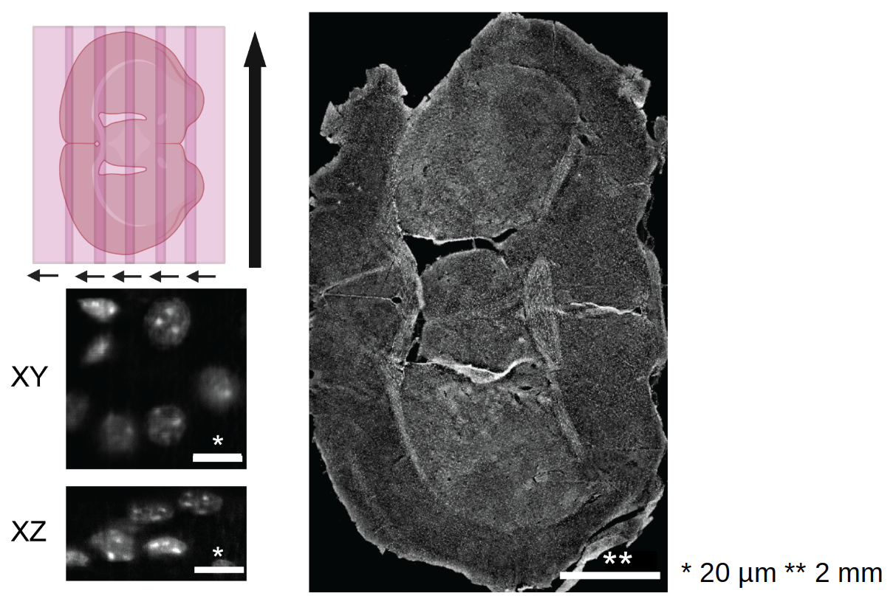
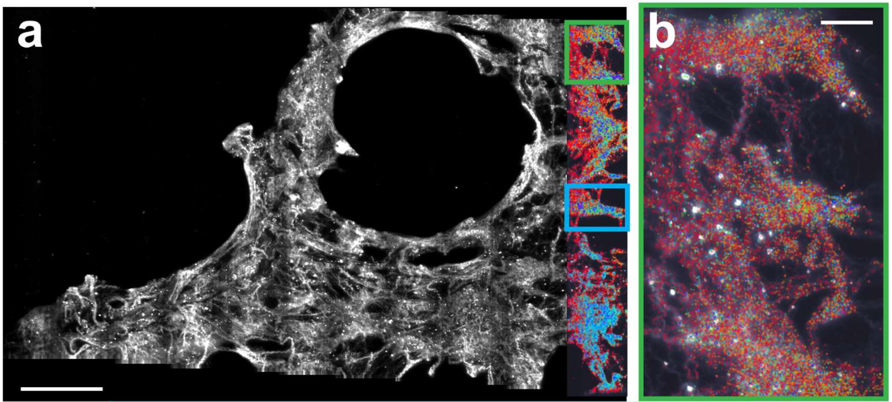
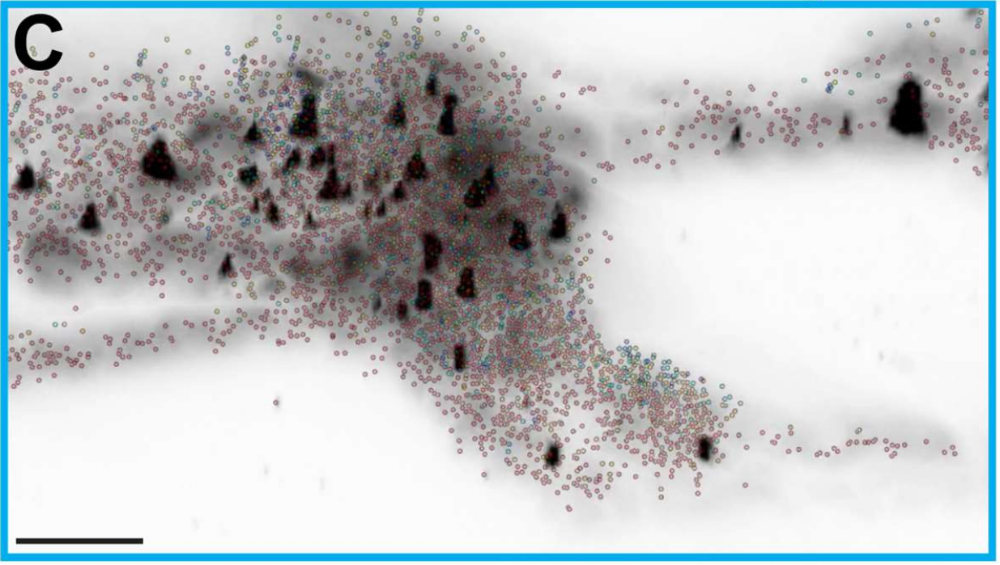

# BRAIN Initiative 9th Annual Meeting

## Poster

## Code and libraries

MERFISH experiment control code: [fork of napari micro-manager](https://github.com/AlexCoul/napari-micromanager/tree/fish)  
Core spot detection: [localize-psf](github.com/QI2lab/localize-psf)  
Real-time deskewing: [OPM](github.com/QI2lab/OPM)  
Spot detection plugin: [napari-spot-detection](github.com/AlexCoul/napari-spot-detection)  
Tissue spatial network reconstruction: [tysserand](github.com/VeraPancaldiLab/tysserand)  
Spatial network analysis: [mosna](https://github.com/AlexCoul/mosna)  

## High NA Oblique Plane (light-sheet) Microscope: Snouty

*Snouty setup. Blue box: microfluidic chamber where the sample is imaged by the primary objective. Red box: the secondary objective creates a virtual image of the area observed by the primary objective. This virtual copy is imaged again by the tertiary objective with a tilt.*

*Big tissue stage scanning, showing polyA probes in a mouse brain sample.*

*3D localization of a 14-plex RNA in 3 mm x 1 cm x 60-micron thick unexpanded human lung tissue, scale bars 250 & 40 µm*

*Lung RNA FISH zoomed, scale bar 40 µm*

## References

### RNA-FISH

[Lein et. al, Science, 2017](https://doi.org/10.1126/science.aan6827)
The promise of spatial transcriptomics for neuroscience in the era of molecular cell typing

[Pardue & Gall, PNAS, 1969](https://doi.org/0.1073/pnas.64.2.600)
Molecular hybridization of radioactive dna to the dna of cytological preparations

[Femino et. al, Science, 1998](https://doi.org/10.1126/science.280.5363.585)
Visualization of Single RNA Transcripts in Situ

[Raj et. al, Nature Methods, 2008](https://doi.org/10.1038/nmeth.1253)
Imaging individual mRNA molecules using multiple singly labeled probes

[Chen et. al, Science, 2015](https://doi.org/10.1126/science.aaa6090)
Spatially resolved, highly multiplexed RNA profiling in single cells

[Beliveau  et. al, PNAS, 2018](https://doi.org/10.1073/pnas.1714530115)
OligoMiner provides a rapid, flexible environment for the design of genome-scale oligonucleotide in situ hybridization probes

[Hershberg et. al, Nature Methods, 2021](https://doi.org/10.1038/s41592-021-01187-3)
PaintSHOP enables the interactive design of transcriptome- and genome-scale oligonucleotide FISH experiments

[Xia et. al, Scientific Reports, 2019](https://doi.org/10.1038/s41598-019-43943-8)
Multiplexed detection of RNA using MERFISH and branched DNA amplification

[Wang et.al, Scientific Reports, 2018](https://doi.org/10.1038/s41598-018-22297-7)
Multiplexed imaging of high-density libraries of RNAs with MERFISH and expansion microscopy

### Microscopy

[Chen et. al, Science, 2014](https://doi.org/10.1126/science.1257998)
Lattice light-sheet microscopy: Imaging molecules to embryos at high spatiotemporal resolution

[Gao et. al, Science, 2019](https://doi.org/10.1126/science.aau8302)
Cortical column and whole-brain imaging with molecular contrast and nanoscale resolution

[Voleti et. al, Nature Methods, 2019](https://doi.org/10.1038/s41592-019-0579-4)
Real-time volumetric microscopy of in vivo dynamics and large-scale samples with SCAPE 2.0

**Snouty**

[Botcherby et. al, Optics Communications, 2008](https://doi.org/10.1016/j.optcom.2007.10.007)
An optical technique for remote focusing in microscopy

[Dunsby, Optics Express, 2008](https://doi.org/10.1364/OE.16.020306)
Optically sectioned imaging by oblique plane microscopy

[Yang et. al, Nature Methods, 2019](https://doi.org/10.1038/s41592-019-0401-3)
Epi-illumination SPIM for volumetric imaging with high spatial-temporal resolution

[Millett-Sikking et. al, Zenodo, 2019](https://doi.org/10.5281/zenodo.3244420)
High NA single-objective light-sheet

[Sapoznik et al., eLife, 2020](https://doi.org/10.7554/eLife.57681)
A versatile oblique plane microscope for large-scale and high-resolution imaging of subcellular dynamics

### Software

[Przybylski et al., Sci. Reports, 2017](https://doi.org/s41598-017-15313-9)
Gpufit: An open-source toolkit for GPU-accelerated curve fitting

[napari contributors, Zenodo, 2019](https://doi.org/10.5281/zenodo.3555620)
Napari
